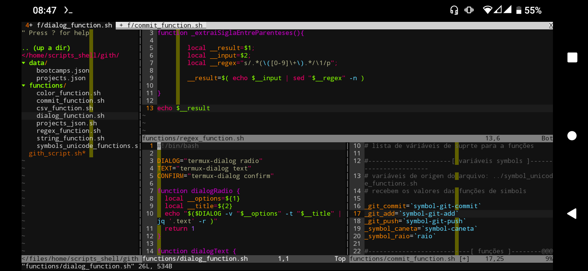

# Gith
Scripts para padronização de commits

Essa é uma ferramenta em desenvolvimento para automação e padronização de commits relacionados ao estudo de bootcamps, cursos e afins.
Está sendo desenvolvida 100% em Shell Script.

## Ambiente de desenvolvimento
 - Android 10
 - Emulado Termux
 - Shell Script
 - Vim
 - ZSH
